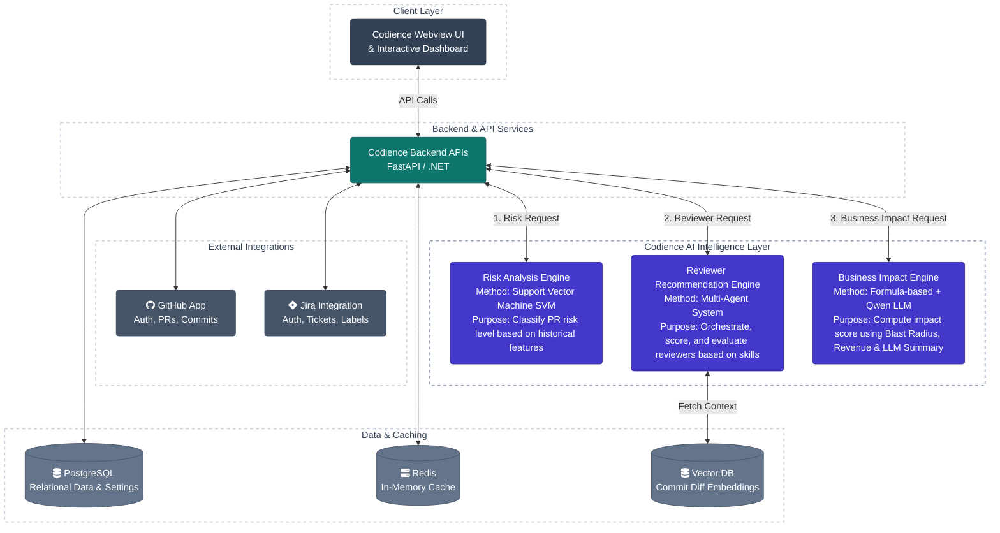

```mermaid
graph TD

    %% Professional Node Styling
    classDef client fill:#334155,stroke:#1e293b,stroke-width:1px,color:#ffffff,rx:4px,ry:4px;
    classDef backend fill:#0f766e,stroke:#115e59,stroke-width:1px,color:#ffffff,rx:4px,ry:4px;
    classDef external fill:#475569,stroke:#334155,stroke-width:1px,color:#ffffff,rx:4px,ry:4px;
    classDef ai fill:#4338ca,stroke:#3730a3,stroke-width:1px,color:#ffffff,rx:4px,ry:4px;
    classDef database fill:#64748b,stroke:#475569,stroke-width:1px,color:#ffffff,rx:4px,ry:4px;

    %% -----------------------------------------
    %% User Interface
    %% -----------------------------------------
    subgraph Frontend [Client Layer]
        UI[Codience Webview UI<br>& Interactive Dashboard]:::client
    end

    %% -----------------------------------------
    %% Backend & Data
    %% -----------------------------------------
    subgraph CoreBackend [Backend & API Services]
        API[Codience Backend APIs<br>FastAPI / .NET]:::backend
    end

    subgraph External [External Integrations]
        GH[fab:fa-github GitHub App<br>Auth, PRs, Commits]:::external
        Jira[fab:fa-jira Jira Integration<br>Auth, Tickets, Labels]:::external
    end
    
    subgraph Storage [Data & Caching]
        DB[(fas:fa-database PostgreSQL<br>Relational Data & Settings)]:::database
        Cache[(fas:fa-server Redis<br>In-Memory Cache)]:::database
        VectorDB[(fas:fa-database Vector DB<br>Commit Diff Embeddings)]:::database
    end

    UI <-->|API Calls| API
    API <--> GH
    API <--> Jira
    API <--> DB
    API <--> Cache

    %% -----------------------------------------
    %% The Three Core AI Engines
    %% -----------------------------------------
    subgraph AIEngines [Codience AI Intelligence Layer]
        
        RiskEngine[Risk Analysis Engine<br>Method: Support Vector Machine SVM<br>Purpose: Classify PR risk level based on historical features]:::ai
        
        ReviewerEngine[Reviewer Recommendation Engine<br>Method: Multi-Agent System<br>Purpose: Orchestrate, score, and evaluate reviewers based on skills]:::ai
        
        BizEngine[Business Impact Engine<br>Method: Formula-based + Qwen LLM<br>Purpose: Compute impact score using Blast Radius, Revenue & LLM Summary]:::ai
        
    end

    API <-->|1. Risk Request| RiskEngine
    API <-->|2. Reviewer Request| ReviewerEngine
    API <-->|3. Business Impact Request| BizEngine
    
    ReviewerEngine <-->|Fetch Context| VectorDB

    %% Style Subgraphs for a clean look
    style Frontend fill:none,stroke:#cbd5e1,stroke-width:2px,stroke-dasharray: 5 5,color:#334155
    style CoreBackend fill:none,stroke:#cbd5e1,stroke-width:2px,stroke-dasharray: 5 5,color:#334155
    style External fill:none,stroke:#cbd5e1,stroke-width:2px,stroke-dasharray: 5 5,color:#334155
    style Storage fill:none,stroke:#cbd5e1,stroke-width:2px,stroke-dasharray: 5 5,color:#334155
    style AIEngines fill:none,stroke:#94a3b8,stroke-width:2px,stroke-dasharray: 5 5,color:#334155

```
